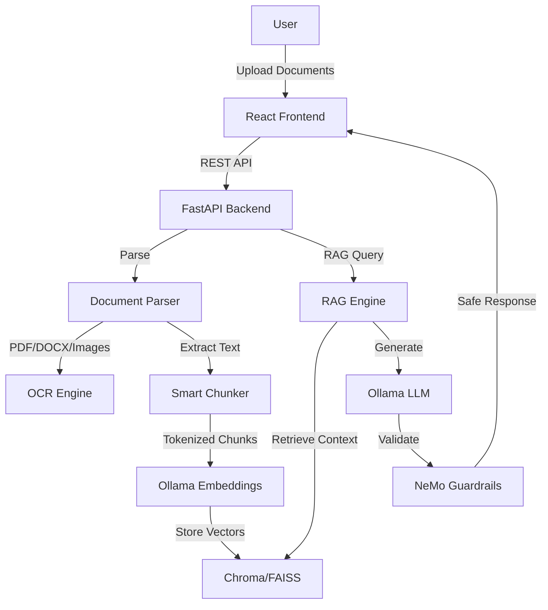

# SecureRAG


**Security-focused RAG system with AI-powered document summarization and a security persona**

SecureRAG is a fully local, privacy-preserving security-focused Retrieval-Augmented Generation (RAG) web application with a security persona. Upload PDFs, Word documents, and images. The system extracts text (with OCR for images), chunks and embeds documents into a local vector database, and provides intelligent security-focused summarization using a local LLM (Ollama) with built-in security guardrails and a specialized security persona.

## ✨ Features

- 🔒 **Privacy-First**: Fully local processing, no cloud dependencies
- 📄 **Multi-Format**: PDF, DOCX, images with OCR support (PDF ingestion is the most stable and tested)
- 🤖 **Local LLM**: Ollama integration (llama2, mistral, qwen, etc.)
- 🛡️ **AI Guardrails**: NeMo Guardrails for input/output validation and security
- 📊 **Auto-Summarization**: Extract summaries, technologies, security insights with a security persona summarizer
- 💬 **RAG Chat**: Conversational interface with source citations
- 🐳 **Docker Ready**: One-command deployment
- 🧪 **Well-Tested**: Comprehensive test suite included

## 🏗️ Architecture



## 🚀 Quick Start

### Prerequisites

1. **Docker & Docker Compose** (recommended)
2. **Ollama** installed locally ([Download](https://ollama.ai))

### Installation

1. **Clone the repository**:
   ```bash
   git clone https://github.com/yourusername/securerag.git
   cd securerag
   ```

2. **Set up Ollama**:
   ```bash
   # Install Ollama from https://ollama.ai
   # Pull a model
   ollama pull llama2
   # Or use other models: mistral, qwen2.5, etc.
   ```

3. **Configure environment**:
   ```bash
   cp .env.example .env
   # Edit .env if needed (defaults work for most cases)
   ```

4. **Start with Docker Compose**:
   ```bash
   docker-compose up --build
   ```

5. **Access the application**:
   - Frontend: http://localhost:3000
   - Backend API: http://localhost:8000
   - API Docs: http://localhost:8000/docs

## ⚙️ Configuration

### Environment Variables

Key configuration options in `.env`:

| Variable | Description | Default |
|----------|-------------|---------|
| `OLLAMA_HOST` | Ollama server URL | `http://localhost:11434` |
| `OLLAMA_MODEL` | Model for embeddings/generation | `llama2` |
| `VECTOR_STORE` | Vector database (`CHROMA` or `FAISS`) | `CHROMA` |
| `MAX_CHUNK_TOKENS` | Maximum tokens per chunk | `700` |
| `TOP_K` | Number of chunks to retrieve | `5` |
| `GUARDRAILS_ENABLED` | Enable NeMo Guardrails | `true` |
| `GUARDRAILS_MODE` | Guardrails strictness (`strict`, `moderate`, `lenient`) | `strict` |

### Recommended Ollama Models

- **For embeddings**: `llama2`, `mistral`, `qwen2.5`
- **For generation**: `llama2:13b`, `mistral:7b`, `qwen2.5:14b-instruct`

## 📖 Usage

### 1. Upload Documents

- Navigate to the **Upload** page
- Drag & drop or select PDF, DOCX, or image files
- **Note**: PDF ingestion is the most stable and tested format
- Add optional metadata (owner, project, tags)
- Wait for ingestion to complete
- View auto-generated summary and detected technologies

### 2. Browse Documents

- View all ingested documents on the **Documents** page
- See summaries, technologies, and focus areas
- Click to view full document details
- Delete documents when no longer needed

### 3. Chat with Documents

- Go to the **Chat** page
- Select documents to query (or use all)
- Ask questions like:
  - "Give me a 3-line summary of the architecture"
  - "List all technologies used"
  - "What are the top 5 focus areas for security analysis?"
- View source citations for each answer

### 4. Export Data

- Export document summaries in JSON or Markdown format
- Use the export API endpoint for programmatic access

## 🔐 Security Features

SecureRAG includes built-in security guardrails powered by NeMo Guardrails:

- **Input Validation**: Detects and blocks jailbreak attempts
- **Malicious Content Filtering**: Prevents harmful queries
- **Output Safety Checks**: Validates LLM responses
- **Citation Enforcement**: Ensures responses cite sources
- **Off-topic Detection**: Keeps conversations focused on documents

### Security Persona Summarizer

The system is configured with a security-focused persona summarizer that:
- Specializes in analyzing system architecture and security documents
- Provides security-focused insights and recommendations through intelligent summarization
- Validates all inputs and outputs for safety
- Enforces proper source citations
- Automatically generates security-aware summaries of uploaded documents

## 📡 API Endpoints

| Endpoint | Method | Description |
|----------|--------|-------------|
| `/health` | GET | Health check |
| `/ingest` | POST | Upload documents |
| `/ingest/url` | POST | Ingest from URL |
| `/documents` | GET | List all documents |
| `/documents/{doc_id}` | GET | Get document details |
| `/documents/{doc_id}` | DELETE | Delete document |
| `/chat` | POST | RAG-powered Q&A |
| `/summary` | GET | Document summary |
| `/export` | POST | Export document data |

Full API documentation: http://localhost:8000/docs

## 🧪 Testing

Run backend tests:
```bash
cd backend
pytest tests/
```

## 📁 Project Structure

```
SecureRAG/
├── backend/              # FastAPI backend
│   ├── app/
│   │   ├── api/         # API endpoints
│   │   ├── services/    # Core services (parser, chunker, RAG, etc.)
│   │   ├── guardrails/  # NeMo guardrails config
│   │   ├── config/      # Configuration and prompts
│   │   └── main.py      # FastAPI app
│   ├── tests/           # Unit tests
│   ├── requirements.txt
│   └── Dockerfile
├── frontend/            # React frontend
│   ├── src/
│   │   ├── pages/       # Page components
│   │   ├── components/  # Reusable components
│   │   └── App.jsx      # Main app
│   ├── package.json
│   └── Dockerfile
├── sample_docs/         # Sample documents for testing
├── docker-compose.yml   # Docker orchestration
├── .env.example         # Environment template
└── README.md
```

## 🔧 Development

### Running Locally (Without Docker)

1. **Backend**:
   ```bash
   cd backend
   python -m venv venv
   source venv/bin/activate  # On Windows: venv\Scripts\activate
   pip install -r requirements.txt
   uvicorn app.main:app --reload --port 8000
   ```

2. **Frontend**:
   ```bash
   cd frontend
   npm install
   npm start
   ```

### Adding New Model Providers

Edit `backend/app/services/model_adapter.py` and add a new adapter class implementing:
- `get_embedding(text: str) -> List[float]`
- `generate_text(prompt: str, system: str, ...) -> str`
- `health_check() -> bool`

## 🐛 Troubleshooting

### Ollama Connection Issues

1. Verify Ollama is running:
   ```bash
   curl http://localhost:11434/api/tags
   ```

2. If using Docker, ensure `OLLAMA_HOST=http://host.docker.internal:11434`

3. Check firewall settings

### Vector Store Errors

- Ensure `./data/chroma` directory exists and is writable
- Try deleting and recreating: `rm -rf ./data/chroma`

### OCR Issues

- Install Tesseract OCR:
  - macOS: `brew install tesseract`
  - Ubuntu: `apt-get install tesseract-ocr`
  - Windows: Download from [GitHub](https://github.com/UB-Mannheim/tesseract/wiki)

### Model Not Found

- Pull the model in Ollama:
  ```bash
  ollama pull llama2
  ```

## 📊 Data Management

### Purging Data

To remove all ingested documents and vector data:
```bash
rm -rf ./data/chroma ./data/raw
```

### Data Location

- Raw documents: `./data/raw/{doc_id}/`
- Vector database: `./data/chroma/`
- Logs: `./data/logs/`

## 🤝 Contributing

Contributions are welcome! Please see [CONTRIBUTING.md](CONTRIBUTING.md) for guidelines.

1. Fork the repository
2. Create a feature branch (`git checkout -b feature/amazing-feature`)
3. Commit your changes (`git commit -m 'Add amazing feature'`)
4. Push to the branch (`git push origin feature/amazing-feature`)
5. Open a Pull Request

## 📝 License

This project is licensed under the MIT License - see the [LICENSE](LICENSE) file for details.

## 🙏 Acknowledgments

- [Ollama](https://ollama.ai) for local LLM support
- [Chroma](https://www.trychroma.com/) and [FAISS](https://github.com/facebookresearch/faiss) for vector storage
- [NeMo Guardrails](https://github.com/NVIDIA/NeMo-Guardrails) for security features
- [FastAPI](https://fastapi.tiangolo.com/) for the backend framework
- [React](https://react.dev/) for the frontend

## 📧 Support

- **Issues**: [GitHub Issues](https://github.com/yourusername/securerag/issues)
- **Discussions**: [GitHub Discussions](https://github.com/yourusername/securerag/discussions)

---

**Made by MoDtHeBoT**

Made with ❤️ for the open-source community
